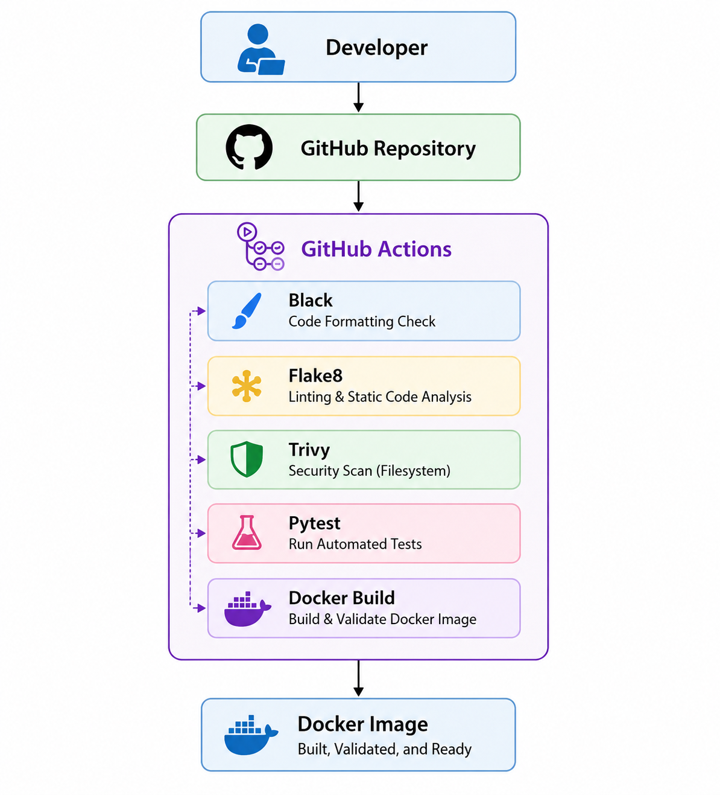

# 🚀 CI/CD Docker Deployment Platform

A production-inspired DevSecOps project demonstrating automated code quality validation, security scanning, testing, and container image building using GitHub Actions, Docker, Python Flask, and Vagrant.

## 📌 Project Overview

This repository showcases a complete CI/CD workflow for a containerized Flask application running inside a reproducible Debian-based Vagrant environment. The pipeline enforces code quality, performs security scanning, executes automated tests, and validates Docker image builds before delivery.

### Key Highlights

- Automated CI pipeline using GitHub Actions
- DevSecOps security scanning with Trivy
- Code quality enforcement using Black and Flake8
- Automated testing with Pytest
- Multi-stage Docker builds
- Non-root container execution
- Docker HEALTHCHECK support
- Reproducible infrastructure with Vagrant
- Architecture and interview-preparation documentation

---

## 🏗️ Architecture

### CI/CD Workflow

```text
Developer
    │
    ▼
GitHub Repository
    │
    ▼
GitHub Actions
 ├── Black
 ├── Flake8
 ├── Trivy Security Scan
 ├── Pytest
 └── Docker Build
    │
    ▼
Docker Image Validation
```

### Architecture Diagram



---

## ✨ Features

- Flask REST-style application
- Health endpoint (`/health`)
- Version endpoint (`/version`)
- Automated unit testing with Pytest
- Black code formatting validation
- Flake8 static code analysis
- Trivy security scanning
- Multi-stage Docker image build
- Non-root container security model
- Docker HEALTHCHECK monitoring
- GitHub Actions CI pipeline
- Vagrant-based development environment

---

## 🛠️ Technology Stack

| Category | Technology |
|-----------|------------|
| Language | Python 3.11 |
| Framework | Flask |
| Testing | Pytest |
| Formatting | Black |
| Linting | Flake8 |
| Security Scanning | Trivy |
| Containerization | Docker |
| CI/CD | GitHub Actions |
| Infrastructure | Vagrant + VirtualBox |
| Web Server | Gunicorn |

---

## 📂 Repository Structure

```text
cicd-docker-deployment/
├── .github/workflows/
│   └── ci.yml
├── app/
├── docker/
├── tests/
├── docs/
│   ├── architecture.md
│   ├── interview-questions.md
│   └── troubleshooting.md
├── screenshots/
├── requirements.txt
├── Vagrantfile
└── README.md
```

---

## ⚙️ Local Development

### Start Vagrant Environment

```bash
vagrant up
vagrant ssh
cd /home/vagrant/cicd-project
```

### Create Virtual Environment

```bash
python3 -m venv venv
source venv/bin/activate
pip install --upgrade pip
pip install -r requirements.txt
```

### Run Tests

```bash
pytest -v
```

### Validate Code Quality

```bash
black --check app tests
flake8 app tests
```

---

## 🐳 Docker Usage

### Build Image

```bash
docker build -t cicd-app:v1 -f docker/Dockerfile .
```

### Run Container

```bash
docker run -d --name cicd-app -p 5000:5000 cicd-app:v1
```

### Verify Application

```bash
curl http://localhost:5000
curl http://localhost:5000/health
curl http://localhost:5000/version
```

---

## 🔄 GitHub Actions Pipeline

The pipeline executes automatically on pushes and pull requests.

### Stages

1. Lint
   - Black
   - Flake8

2. Security Scan
   - Trivy Filesystem Scan

3. Test
   - Pytest

4. Docker Build
   - Multi-stage Docker Build Validation

Pipeline Flow:

```text
Lint
 ↓
Security Scan
 ↓
Test
 ↓
Docker Build
```

---

## 🔐 Security Controls

- Trivy vulnerability scanning
- Non-root Docker container
- Multi-stage Docker build
- Minimal runtime image
- Automated CI validation

---

## 📚 Documentation

Additional project documentation:

- docs/architecture.md
- docs/interview-questions.md
- docs/troubleshooting.md

---

## 🖼️ Screenshots

- Vagrant VM Provisioning
- Docker Installation
- Docker Image Build
- Container Execution
- Application Validation
- Automated Testing
- Architecture Diagram

---

## 🎯 DevOps Concepts Demonstrated

- Continuous Integration (CI)
- DevSecOps
- Infrastructure Reproducibility
- Automated Testing
- Static Code Analysis
- Containerization
- Security Scanning
- Production Container Practices

---

## 👤 Author

Muhammad Kamran Kabeer

DevOps Engineer | IT Lab Manager | Technical Trainer

GitHub: https://github.com/muhammadkamrankabeer-oss
