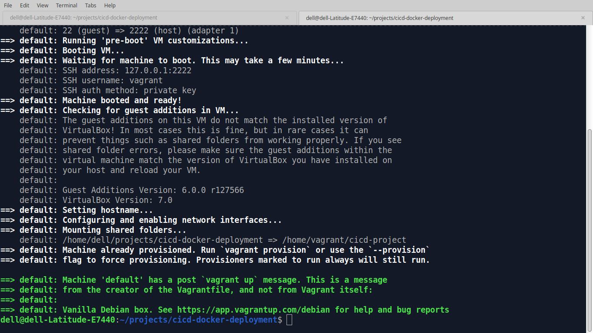
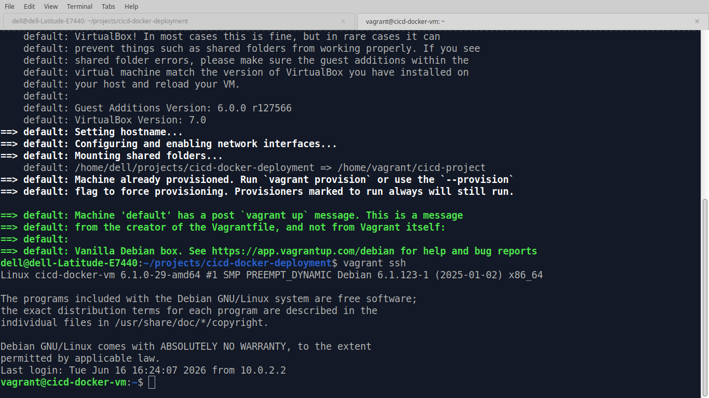
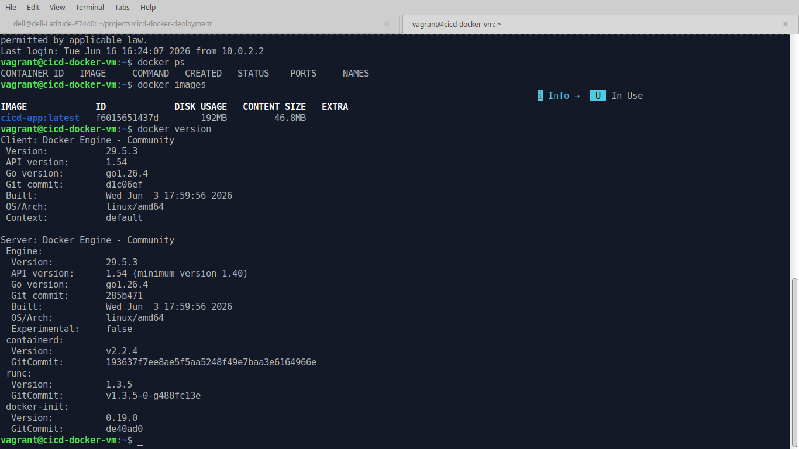
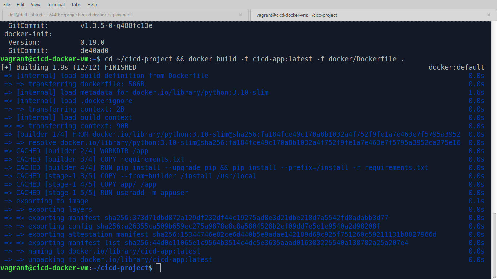
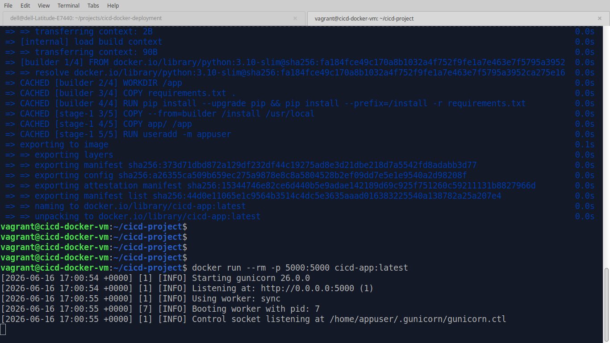
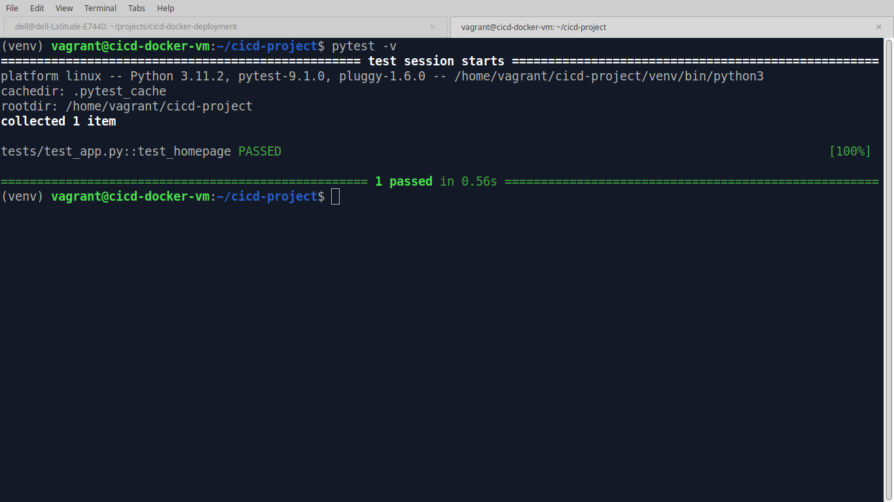
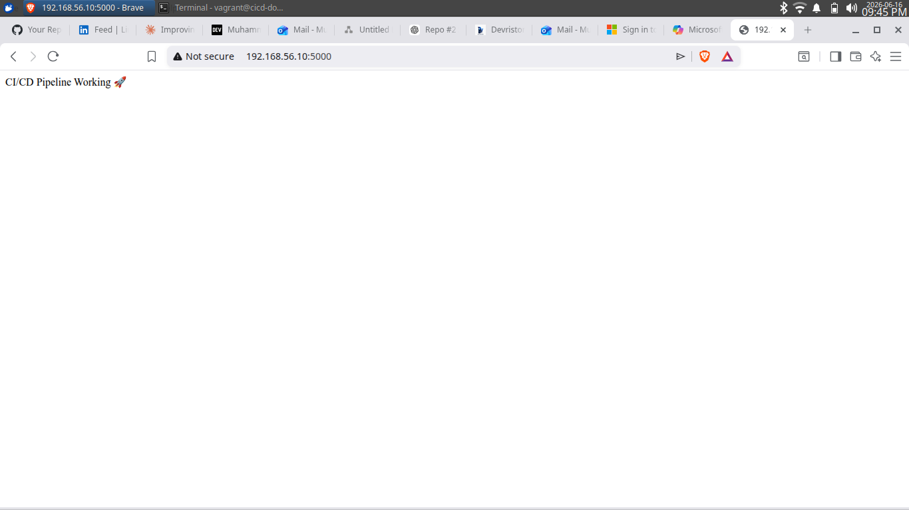
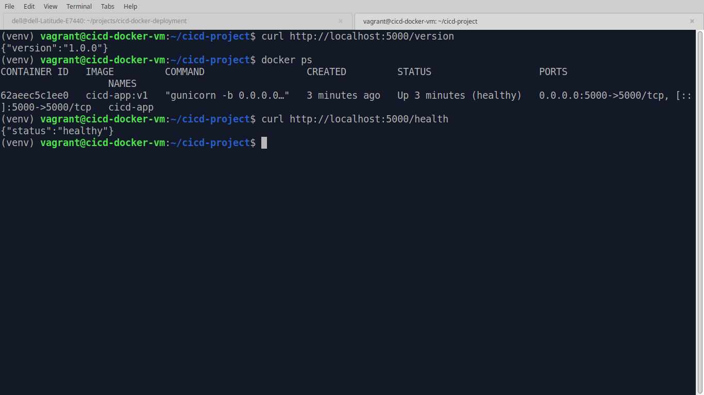

<div align="center">

# 🚀 CI/CD Docker Deployment Platform

**A production-inspired DevSecOps pipeline — automated linting, security scanning, testing, and multi-stage Docker builds for a Flask application, running on a reproducible Vagrant environment.**

<p>
  
  
  
  
  
  
  
  
</p>

<p>
  <a href="https://github.com/muhammadkamrankabeer-oss/cicd-docker-deployment/actions"></a>
  <a href="https://github.com/muhammadkamrankabeer-oss/cicd-docker-deployment/stargazers"></a>
</p>

</div>

---

## 📌 Project Overview

This repository demonstrates a complete DevSecOps CI/CD workflow for a containerized Flask application running inside a reproducible Debian-based Vagrant environment. Every push enforces code quality, scans for vulnerabilities, runs the test suite, and validates the Docker build — before any image is considered deployable.

### Key Highlights

- ⚙️ Automated CI pipeline using GitHub Actions
- 🔐 DevSecOps security scanning with **Trivy**
- 🎨 Code quality enforcement with **Black** and **Flake8**
- 🧪 Automated testing with **Pytest**
- 🐳 Multi-stage Docker builds with a non-root runtime user
- 🩺 Docker `HEALTHCHECK` hitting a real `/health` endpoint
- 📦 Reproducible infrastructure with **Vagrant**
- 📚 Architecture and interview-preparation documentation

---

## 🏗️ Architecture

### CI/CD Workflow

```text
Developer
    │
    ▼
GitHub Repository
    │
    ▼
GitHub Actions
 ├── Black           (formatting check)
 ├── Flake8          (static analysis)
 ├── Trivy           (security scan)
 ├── Pytest          (automated tests)
 └── Docker Build    (multi-stage build validation)
    │
    ▼
Docker Image Validated ✅
```

### Architecture Diagram


---

## ✨ Features

| Feature | Description |
|---|---|
| `/` | Returns app name and running status |
| `/health` | Health endpoint, used by Docker `HEALTHCHECK` |
| `/version` | Returns current app version |
| Pytest suite | Automated unit tests on every push |
| Black + Flake8 | Enforced formatting and static analysis |
| Trivy scan | Filesystem vulnerability scanning in CI |
| Multi-stage Dockerfile | Slim runtime image, non-root user |
| Vagrant environment | Reproducible Debian-based dev VM |

---

## 🛠️ Technology Stack

| Category | Technology |
|-----------|------------|
| Language | Python 3.11 |
| Framework | Flask |
| Testing | Pytest |
| Formatting | Black |
| Linting | Flake8 |
| Security Scanning | Trivy |
| Containerization | Docker (multi-stage) |
| CI/CD | GitHub Actions |
| Infrastructure | Vagrant + VirtualBox |
| Web Server | Gunicorn |

---

## 📂 Repository Structure

```text
cicd-docker-deployment/
├── .github/workflows/
│   └── ci.yml                    # Lint → Security Scan → Test → Docker Build
├── app/
│   ├── __init__.py
│   └── app.py                    # Flask app — /, /health, /version
├── docker/
│   └── Dockerfile                # Multi-stage build, non-root user, HEALTHCHECK
├── docs/
│   ├── architecture.md
│   ├── interview-questions.md
│   └── troubleshooting.md
├── tests/
│   ├── __init__.py
│   └── test_app.py
├── screenshots/                  # Workflow & architecture screenshots
├── requirements.txt
├── Vagrantfile
└── README.md
```

---

## ⚙️ Local Development

### 1. Start the Vagrant Environment
```bash
vagrant up
vagrant ssh
cd /home/vagrant/cicd-project
```

### 2. Create a Virtual Environment
```bash
python3 -m venv venv
source venv/bin/activate
pip install --upgrade pip
pip install -r requirements.txt
```

### 3. Run Tests
```bash
pytest -v
```

### 4. Validate Code Quality
```bash
black --check app tests
flake8 app tests
```

---

## 🐳 Docker Usage

### Build the Image
```bash
docker build -t cicd-app:v1 -f docker/Dockerfile .
```

### Run the Container
```bash
docker run -d --name cicd-app -p 5000:5000 cicd-app:v1
```

### Verify the Application
```bash
curl http://localhost:5000
curl http://localhost:5000/health
curl http://localhost:5000/version
```

---

## 🔄 GitHub Actions Pipeline

The pipeline runs automatically on every push and pull request to `main`.

```text
Lint (Black + Flake8)
        ↓
Security Scan (Trivy)
        ↓
Test (Pytest)
        ↓
Docker Build Validation
```

| Stage | What it does |
|---|---|
| **Lint** | Fails the build on formatting or static analysis violations |
| **Security Scan** | Trivy scans the filesystem for known vulnerabilities |
| **Test** | Runs the full Pytest suite |
| **Docker Build** | Builds the multi-stage image to confirm it's deployable |

---

## 🔐 Security Controls

- Trivy filesystem vulnerability scanning in CI
- Non-root container execution (`appuser`)
- Multi-stage build keeps the runtime image minimal
- Docker `HEALTHCHECK` against a real `/health` route
- ⚠️ **Note:** `.vagrant/` is excluded via `.gitignore` going forward — if you're forking this repo, run `git rm -r --cached .vagrant` before pushing to avoid committing local VM keys.

---

## 📚 Documentation

- [`docs/architecture.md`](docs/architecture.md) — full architecture breakdown
- [`docs/interview-questions.md`](docs/interview-questions.md) — Q&A on the design decisions behind this project
- [`docs/troubleshooting.md`](docs/troubleshooting.md) — common issues and fixes

---

## 🖼️ Screenshots

| | |
|---|---|
| Vagrant VM provisioned (`vagrant up`) | SSH into the VM |
|  |  |
| Docker installed in VM | Docker image build |
|  |  |
| Container running | Tests passing |
|  |  |
| App in browser | Container health monitoring |
|  |  |

---

## 🎯 DevOps Concepts Demonstrated

- Continuous Integration (CI)
- DevSecOps practices
- Infrastructure reproducibility (Vagrant)
- Automated testing & static analysis
- Containerization & multi-stage builds
- Security scanning in the pipeline
- Production-style container hardening (non-root, healthchecks)

---

## 👤 Author

**Muhammad Kamran Kabeer**
Founder & DevOps Engineer · Devriston · IT Lab Manager & Technical Trainer

<p>
  <a href="https://www.devriston.com.pk"></a>
  <a href="https://www.linkedin.com/in/kamrankabeer/"></a>
  <a href="https://github.com/muhammadkamrankabeer-oss"></a>
  <a href="https://dev.to/muhammadkamrankabeeross"></a>
</p>
